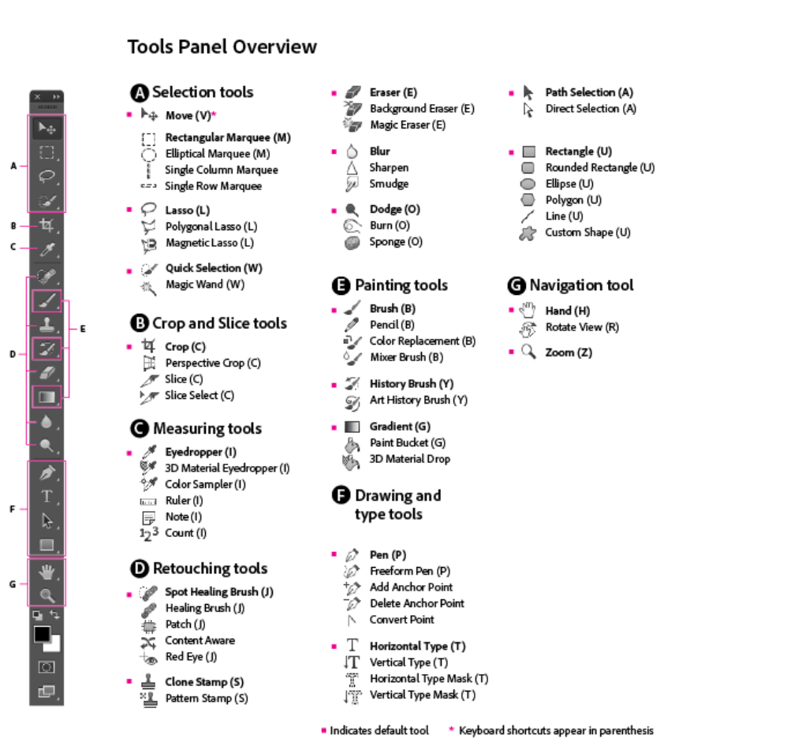

### Workspace & preference & Discover_plane

---

- 当设置好符合自己使用习惯的工作区后，可通过 window > workspace > Lock Workspace来锁定工作区面板，防止意外移动工作区。

- 数字的输入字段可以使用基本的数学运算，例如+ - / *

- 在首选项中可设置的功能：常规显示设置，性能设置，预设等选项

- 由于n卡驱动兼容问题，将首选项中的图像处理改为 more stable会使得程序崩溃中断的可能性更小。

- 首选项备份路径（换版本时可能会做的事情）：userRpaming/Adobe/Adobe Photoshop [version]/Adobe Photoshop [version] Settings

- 恢复被关闭的警告消息：首选项 > 恢复所有的警告对话框。

- ctrl + f 调出discover面板
  
  - discoverbrowse部分的tutorials部分能否浏览并跟着实操教程（很实用）
  
  - Quick action部分能够调出一些如模糊背景，磨皮，转换成黑白图片的动作。
    
    - diffuse glow filter扩散亮光滤镜：获得朦胧梦幻的效果
    
    - remove JPEG filter移除压缩图片产生的瑕疵，让图像更加清晰
    
    - 使用discover面板在联机状态下能搜索并跳转到相应资源如字体

- 使用Adobe stock中的模板时注意是否授权license

- 常用快捷键：https://helpx.adobe.com/cn/photoshop/using/default-keyboard-shortcuts.html
  
  - 重做的快捷键：shift+control+Z, 可以推到上一步骤
  
  - 取消现在进行的操作：esc

- 工具分类 
  
  - 工具详解
    
    - the type mask tools: 在当前图层输入文字，直接创建文字蒙版。

- 大多数adobe产品之间可以互相导入格式
